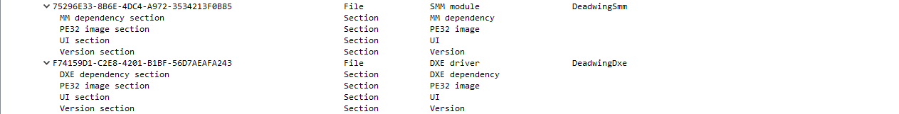

# Building OVMF package with Deadwing SMM & DXE drivers
 
This topic describes how to configure **EDK2** to build **OVMF** and then run **QEMU**.

## Adding SMM driver to OvmfPkg build rules

In order to add the SMM driver to the build, you need to add its source code to the folder with the necessary configuration files. To do this, create a **DeadwingSmm** & **DeadwingDxe** directories in the **OvmfPkg** directory and copy the configuration files (`.inf`, `.uni`) and the source code there.
After adding everything needed, the `.dsc` and `.fdf` files are edited. Since the project works under x64, `OvmfPkgX64.dsc` and `OvmfPkgX64.fdf` files are edited. 

The path to the `.inf` file is added to `OvmfPkgX64.dsc`:
```
!if $(SMM_REQUIRE) == TRUE 
  OvmfPkg/SmmAccess/SmmAccess2Dxe.inf
  OvmfPkg/SmmControl2Dxe/SmmControl2Dxe.inf
  OvmfPkg/CpuS3DataDxe/CpuS3DataDxe.inf
  # Our SMM driver & DXE drivers
  OvmfPkg/DeadwingSmm/DeadwingSmm.inf
  OvmfPkg/DeadwingDxe/DeadwingDxe.inf

  #
  # SMM Initial Program Load (a DXE_RUNTIME_DRIVER)
  #
  MdeModulePkg/Core/PiSmmCore/PiSmmIpl.inf
  
  ...
```

The `OvmfPkgX64.fdf` file also adds the path to the `.inf` file. `OvmfPkgX64.fdf` contains all drivers that will be later added to the firmware image.

```
!if $(SMM_REQUIRE) == TRUE
INF  OvmfPkg/SmmAccess/SmmAccess2Dxe.inf
INF  OvmfPkg/SmmControl2Dxe/SmmControl2Dxe.inf
INF  OvmfPkg/CpuS3DataDxe/CpuS3DataDxe.inf
INF  MdeModulePkg/Core/PiSmmCore/PiSmmIpl.inf
INF  MdeModulePkg/Core/PiSmmCore/PiSmmCore.inf
INF  OvmfPkg/CpuHotplugSmm/CpuHotplugSmm.inf
INF  UefiCpuPkg/CpuIo2Smm/CpuIo2Smm.inf
INF  MdeModulePkg/Universal/LockBox/SmmLockBox/SmmLockBox.inf
INF  UefiCpuPkg/PiSmmCpuDxeSmm/PiSmmCpuDxeSmm.inf
# Our SMM driver & DXE drivers
INF  OvmfPkg/DeadwingSmm/DeadwingSmm.inf
INF  OvmfPkg/DeadwingDxe/DeadwingDxe.inf
```

## Editing build configuration

> [!IMPORTANT]
> It is important to build **OvmfPkg** with **DeadwingSmm** & **DeadwingDxe** exactly in `NOOPT`, otherwise bugs may occur. If you build **OvmfPkg** without **DeadwingSmm** & **DeadwingDxe**, you can put any `TARGET` you want.

In the **Conf** folder we are interested in two files: `target.txt` and `tools_def.txt`. The following lines should be edited in the `target.txt` file: `ACTIVE_PLATFORM`, `TARGET_ARCH`, `TOOL_CHAIN_TAG`:

```
ACTIVE_PLATFORM       = OvmfPkg\OvmfPkgX64.dsc
TARGET                = NOOPT
TARGET_ARCH           = X64
TOOL_CHAIN_TAG        = VS2019
```

The `tools_def.txt` file changes the configurations associated with VS2019. Since my code has always been considered unsafe, we will change configurations for the compiler, more specifically, change flags from `/WX` to `/WX-` (or remove `-Werror` if you're using GCC). Look for all of this from line 700 in `tools_def.txt`.

## Building firmware

Now that the configuration files have been edited, go to the root of the **edk2** folder and enter the following commands:

```
edksetup
build -DSMM_REQUIRE
```

If everything compiled fine, you can see the output files in `\edk2\Build\OvmfX64\NOOPT_VS2019\` (or `\edk2\Build\OvmfX64\NOOPT_GCC5\`). We need the **FV** folder because it contains the built firmware (`OVMF_CODE.fd` and `OVMF_VARS.fd`). We can make sure that our driver is present in the firmware, for example, by using **UEFITool**:



## Running OVMF in Qemu (Linux, virt-manager)

To add custom firmware for Qemu, you need to create a configuration file in `/qemu/share/firmware` and set your path to `OVMF-CODE.fd` and `OVMF-VARS.fd` (located in the same folder as our compiled firmware):
 
```json
{
    "description": "Firmware with Deadwing SMM driver",
    "interface-types": [
        "uefi"
    ],
    "mapping": {
        "device": "flash",
        "executable": {
            "filename": "/path/to/OVMF-CODE.fd",
            "format": "raw"
        },
        "nvram-template": {
            "filename": "/path/to/OVMF-VARS.fd",
            "format": "raw"
        }
    },
    "targets": [
        {
            "architecture": "x86_64",
            "machines": [
                "pc-i440fx-*",
                "pc-q35-*"
            ]
        }
    ],
    "features": [
        "acpi-s3",
        "amd-sev",
        "verbose-dynamic"
    ],
    "tags": [

    ]
}
```

When creating the virtual machine, you need to add custom configurations, select **"Customize configuration before install"**, then, select the firmware with the description **"Firmware with Deadwing SMM driver"**.

## Running OVMF in Qemu (Windows)

Under Windows, there are no frontends for Qemu that support native firmware selection. Therefore, the easiest thing to do is to use a custom config that will load the firmware with the system. An example config can be seen below (of course, the same config can be used under Linux):

```batch
set MACHINE_CONFIG=-m 8096 -smp 4,sockets=1,cores=2,threads=2

set OVMF_CODE=-drive if=pflash,format=raw,unit=0,file=path\to\OVMF_CODE.fd,readonly=on
set OVMF_VARS=-drive if=pflash,format=raw,unit=1,file=path\to\OVMF_VARS.fd,readonly=off

set DRIVE=-device ahci,id=ahci -device ide-hd,drive=disk,bus=ahci.0
set WINDOWS_DISK=-drive id=disk,file=path\to\Disk.qcow2,if=none

pushd "path\to\qemu-bins"
qemu-system-x86_64.exe %MACHINE_CONFIG% -machine q35,smm=on,accel=tcg \
-global driver=cfi.pflash01,property=secure,value=on %OVMF_CODE% %OVMF_VARS% \
-device ramfb \ 
-device VGA \
-device usb-ehci,id=usbctrl -device usb-kbd -device usb-tablet \ 
%DRIVE% %WINDOWS_DISK% \
-global ICH9-LPC.disable_s3=1 \ 
-netdev user,id=net0,hostfwd=tcp::3589-:3389 -device e1000,netdev=net0 \
popd
```

This configuration **requires** a disk with Windows already installed. If you are using a different virtual machine (for example, VMWare), you can convert the disk image of one machine to a `qcow2` image. This is recommended as it can improve performance.

```
qemu-img convert -c -p -O qcow2 VMWareDisk.vmdk QemuDisk.qcow2 
```

## Debugging OVMF with Qemu

For debugging, Qemu has a built-in `gdbserver` that allows any debugger to connect to it. For Windows users, there is a [tutorial](https://learn.microsoft.com/en-us/windows-hardware/drivers/debugger/setting-up-qemu-kernel-mode-debugging-using-exdi) on how to build `EXDI` and connect to the `gdbserver`.
