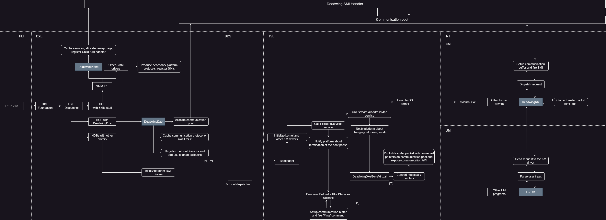
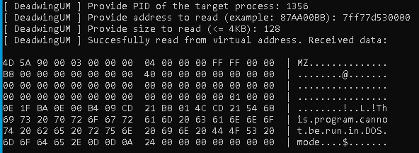
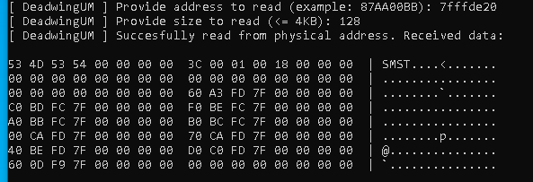
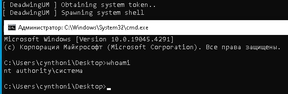

# Deadwing

This repository **demonstrates** the possibility of communication between user mode and SMM to achieve user goals. This project is designed to give an ability to researchers (I guess?) to work with the platform "unconstrained" through inter-mode communication between user mode and SMM (R3 <-> R0 <-> R-2, respectively) with specific SMI data being passed to the handler "directly".

**Deadwing** is currently a simple utility to read and write memory (virtual, physical), memory translation and dump ACPI tables, however, the list will be expanded over time.

## Boot sequence with Deadwing

The boot sequence along with the **Deadwing** drivers is described in the image below: 



A more detailed description is below:

1. DXE Dispatcher finds a HOB with SMM drivers that contains an SMM driver - **Deadwing**. The driver **caches some services, allocates a page to handle virtual addresses and registers an SMI** with a specific GUID (Child SMI). The SMI handler will later validate the data and process the user's commands.
2. DXE Dispatcher finds a HOB with some DXE drivers. Such a HOB may contain the following driver - **DeadwingDxe**. This DXE driver is responsible for **caching the protocol for communication, publishing the data package to the OS kernel modules and exposing several APIs for communication with SMM**. To achieve these goals, the driver **establishes two callbacks**. The first callback is responsible for **determining whether an SMI handler is available**. The second one is responsible for **converting and publishing the data package**. The exposed API, which will later be used by the OS kernel module, is responsible for **setting up the data buffer and convoying it to the SMM**.

## Working in RT phase

The work in the RT phase is as follows:

1. The user starts the user application (**DwUM**). Then, enters the `cache` command - this is necessary to cache data about the current session (**Dir Base** and **EPROCESS** of the kernel and user application are cached).
2. The user application **sends a request** to the driver.
3. The driver **processes the user data packet, setups a buffer based on the received data, and fires the SMI**.
4. The SMI handler **receives the setuped buffer, validates it, executes the command, fills the communication buffer with its own data, edits the user buffer (if any), and returns control to the system**.
5. The driver **gets the status with which the command was processed** and, if all is well, the user application can get the necessary data.

## Building
The project is being built on MSVC (v143+), **specifically** the kernel driver and user application. SMM and DXE drivers **can be built by any compiler**, as long as **EDK2** build utilities are used.

The project uses **VisualUefi** to work with **EDK2** under VS. The project structure has the following representation:

```
<Random folder>
|
|-- EFI (VisualUefi folder)
|    |- debugger
|    |- edk2
|    |- EDK-II
|    |- openssl
|
|-- Deadwing (Project folder)
|      |- Deadwing
|            |- Deadwing    (SMM driver)
|            |- DeadwingDxe (DXE driver)
|            |- DeadwingKM  (Kernel driver)
|            |- DeadwingUM  (Controller app)
```

To build **OVMF** images, navigate to `Ovmf/OVMF.md`.

> [!IMPORTANT]
> Also, pay attention to the `Conf.h` headers in the DXE and SMM code directories, they configure some subtle compilation points.

## Running 

> [!CAUTION]
> **This project has not been tested on physical machines. All actions are at your own risk, and I'm not responsible for any damage caused. Test on machines with Flashback technology or have a SPI flash programmer at hand.**

The project provides the possibility to start as a **normal driver** or by **infecting other drivers** (this is true for both SMM driver and DXE driver). In the first case, the driver will start its entry point immediately. In the second case, the driver will move to new pages, initialize, and return control to the infected driver.

Also, the user can try to patch their firmware to be able to run drivers without infection.

## Commands list

|   Command   |                      Description                         |
|    :---:    |                         :---:                            |
| `ping`      | Pings SMI handler                                        |
| `cache`     | Caches information about current session                 |
| `physread`  | Reads from physical address                              |
| `varead`    | Reads from virtual address                               |
| `physwrite` | Writes to the physical address                           |
| `vawrite`   | Writes to the virtual address                            |
| `vtop`      | Translates virtual address to the physical address       |
| `priv`      | Changes process token and spawns system shell            |
| `exit`      | Exits from UM application without KM service termination |
| `term`      | Exits from UM application with KM service termination    |


## Output examples

1. `varead` command (`notepad.exe` base address)
   
   

2. `physread` command (`SMST` table address)
   
   
   
3. `priv` command
   
   

## Acknowledgements

- **Cr4sh, SmmRootkit** - for the memory page remapping idea.

## Credits

@0x00Alchemist, 2024